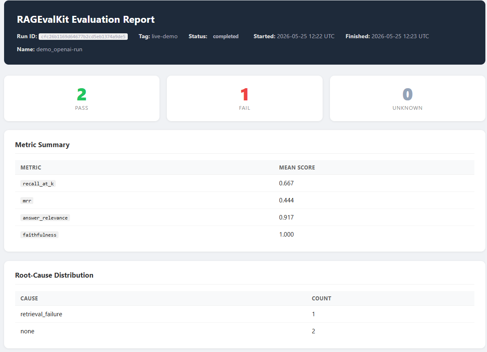
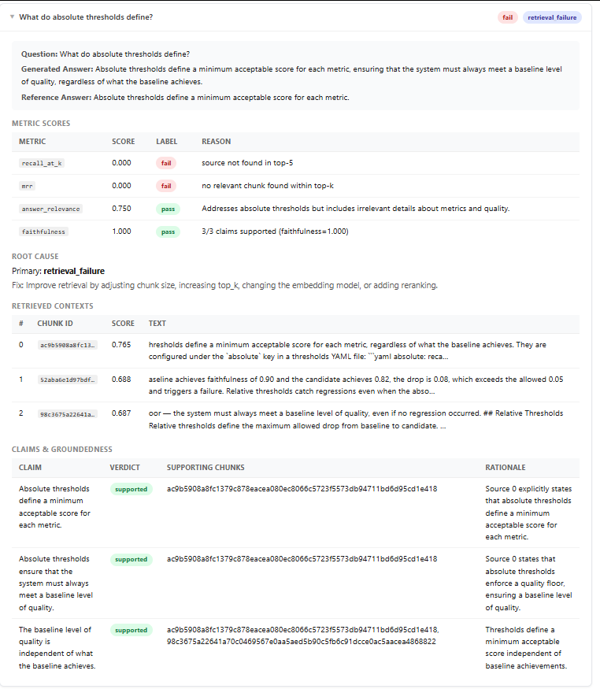
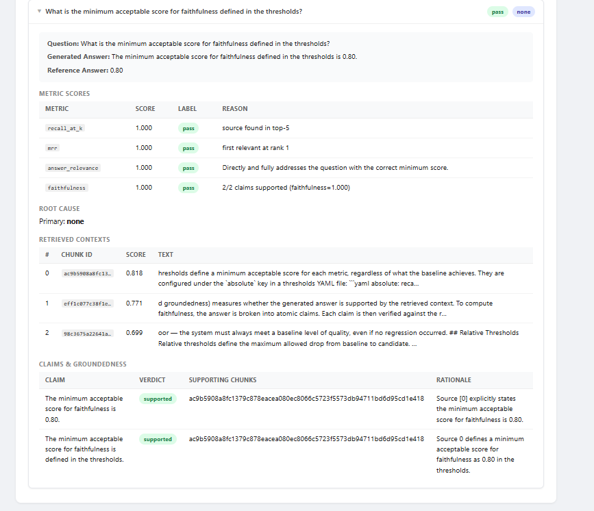
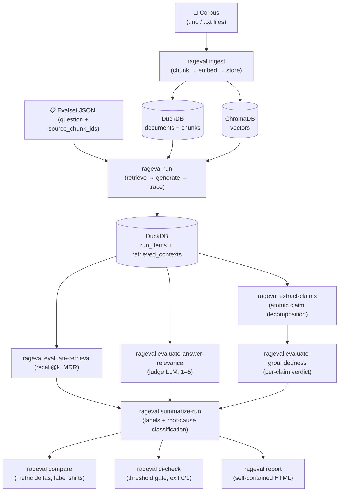

# RAGEvalKit

**A CLI-first RAG evaluation and regression-testing framework for diagnosing retrieval and generation failures.**

---

## The Problem

Shipping a RAG chatbot is easy; knowing whether a pipeline change improved or broke it is hard.

Swap the embedding model and accuracy might go up on some questions while silently regressing on others. Change the chunk size and recall could drop without your answer-quality metrics noticing, because the LLM compensates by hallucinating. Without systematic evaluation across the full pipeline — retrieval *and* generation — regressions go undetected until users notice.

RAGEvalKit evaluates both stages, traces every run, and gives you a CI gate to fail the build before regressions ship.

---

## Key Features

| Feature | Command |
|---------|---------|
| Document ingestion (Markdown, TXT) with chunking and embedding | `rageval ingest` |
| Synthetic evalset generation via LLM-as-judge | `rageval generate-evalset` |
| Full RAG run tracing (retrieval + generation + contexts) | `rageval run` |
| Retrieval metrics: recall@k and MRR | `rageval evaluate-retrieval` |
| Answer relevance judging (1–5 scale, pass/fail) | `rageval evaluate-answer-relevance` |
| Atomic claim extraction from answers | `rageval extract-claims` |
| Groundedness / faithfulness judging per claim | `rageval evaluate-groundedness` |
| Root-cause classification (retrieval / grounding / relevance failure) | `rageval summarize-run` |
| Run-to-run metric comparison | `rageval compare` |
| CI threshold checks (absolute floors + relative regression limits) | `rageval ci-check` |
| Self-contained static HTML report | `rageval report` |

---

## Screenshots

### Report summary: metric scores, pass/fail cards, root-cause distribution



### Retrieval failure case: answer is relevant and faithful, but the retriever missed the source chunk



### Success case: retrieval, answer relevance, and faithfulness all pass



---

## Install

```bash
git clone https://github.com/your-username/RAGEvalKit.git
cd RAGEvalKit
pip install -e ".[dev]"
```

---

## CI

<!-- After pushing to GitHub, replace the URL below with your actual repo path:

-->

Two workflows ship with the repo:

- **`tests.yml`** — runs on every push and PR. Mock-only (`DummyEmbedder` + `MockLLMClient`). No API key, no model downloads, deterministic. Covers all 700+ tests.
- **`live-demo.yml`** — manual trigger only (`workflow_dispatch`). Requires `OPENAI_API_KEY` as a repository secret. Runs the full 10-step OpenAI pipeline and uploads the HTML report as an artifact.

See [docs/demo_script.md](docs/demo_script.md#github-actions-ci-workflows) for setup instructions including how to add the `OPENAI_API_KEY` secret.

---

## Quickstart: Mock/Dev Mode (no API key required)

The fastest way to see the full pipeline. Uses a deterministic `DummyEmbedder` and a `MockLLMClient` — no model downloads, no API calls.

```bash
# 1. Initialize workspace
rageval init

# 2. Ingest the tiny dev corpus (3 short docs)
rageval ingest examples/tiny-corpus

# 3. Generate a synthetic evalset (mock LLM)
rageval generate-evalset examples/tiny-corpus \
  --num-questions 3 \
  --output evalsets/dev.jsonl

# 4. Run the RAG pipeline
rageval run \
  --evalset evalsets/dev.jsonl \
  --tag "dev-run"

# 5. Evaluate all metrics
rageval evaluate-retrieval --run <RUN_ID>
rageval evaluate-answer-relevance --run <RUN_ID>
rageval extract-claims --run <RUN_ID>
rageval evaluate-groundedness --run <RUN_ID>
rageval summarize-run --run <RUN_ID>

# 6. Generate the HTML report
rageval report --run <RUN_ID> --output report.html
```

The default config uses `provider: dummy` for embeddings and `provider: mock` for the LLM, so no external dependencies are required.

---

## Live OpenAI Demo

Runs the full 10-step pipeline on a realistic 3-document corpus with real OpenAI calls. Produces the screenshots above.

```bash
export OPENAI_API_KEY=sk-...   # bash/zsh
# $env:OPENAI_API_KEY = "sk-..."  # PowerShell

bash examples/demo_live_openai.sh        # bash
.\examples\demo_live_openai.ps1          # PowerShell
```

The script runs `gpt-4o-mini` for both generation and judging. Expected cost: a fraction of a cent for the default 3-item run.

See [docs/live_demo.md](docs/live_demo.md) for full instructions.

---

## Example Metric Output

Results from the live OpenAI demo on the 3-document RAG evaluation corpus:

```
Run: live-demo  |  3 items evaluated

┌──────────────────────┬────────┐
│ Metric               │  Mean  │
├──────────────────────┼────────┤
│ recall@5             │ 0.667  │
│ MRR                  │ 0.444  │
│ answer_relevance     │ 0.917  │
│ faithfulness         │ 1.000  │
└──────────────────────┴────────┘

Labels:  2 pass  |  1 fail  |  0 unknown

Root causes:
  retrieval_failure  ×1
```

### The Interesting Failure Case

One item passed answer relevance (score 4/5) and faithfulness (score 1.0) but still failed overall because RAGEvalKit detected a **retrieval failure**: the retriever did not surface the original source chunk.

This is the key insight: **answer-quality metrics alone can hide retrieval regressions.** The model happened to produce a good answer from nearby chunks, but the correct chunk was missed. If you only evaluated answer quality, this item would appear to pass. RAGEvalKit flags it because recall@k = 0.0 for that item.

---

## Architecture



See [docs/architecture.md](docs/architecture.md) for component details.

---

## CI Regression Gate

Define thresholds in `rageval.yaml`:

```yaml
thresholds:
  absolute:
    recall_at_k_min: 0.70
    answer_relevance_min: 0.70
    faithfulness_min: 0.80
  relative:
    recall_at_k_drop_max: 0.05
    faithfulness_drop_max: 0.05
    answer_relevance_drop_max: 0.05
```

Run the gate:

```bash
rageval ci-check \
  --baseline $BASELINE_RUN_ID \
  --candidate $CANDIDATE_RUN_ID \
  --thresholds rageval.yaml
```

Exit code 0 = all thresholds satisfied. Exit code 1 = at least one violation. Add `--json` for machine-readable output in CI pipelines.

See [docs/cli.md](docs/cli.md) for full option reference.

---

## Metrics

| Metric | What it measures |
|--------|-----------------|
| **recall@k** | Fraction of ground-truth relevant chunks retrieved in the top-k results |
| **MRR** | Mean Reciprocal Rank — how highly the first relevant chunk is ranked |
| **answer_relevance** | Judge LLM score (1–5) for whether the answer addresses the question |
| **faithfulness** | Fraction of answer claims that are supported by retrieved context |

See [docs/metrics.md](docs/metrics.md) for formulas and failure-mode diagnosis.

---

## CLI Reference

```
rageval init                    Initialize .rageval/ workspace
rageval ingest <corpus>         Ingest documents: chunk, embed, store in DuckDB + Chroma
rageval retrieve                Query the vector store interactively
rageval generate-evalset        Generate synthetic Q&A evalset from corpus
rageval run                     Run full RAG pipeline on evalset
rageval evaluate-retrieval      Compute recall@k and MRR
rageval evaluate-answer-relevance  Judge answer relevance with LLM
rageval extract-claims          Extract atomic claims from generated answers
rageval evaluate-groundedness   Judge groundedness of claims vs. retrieved context
rageval summarize-run           Assign pass/fail labels and classify root causes
rageval compare                 Compare metric means and distributions between runs
rageval ci-check                Threshold-based CI gate (exits 1 on regression)
rageval report                  Generate self-contained HTML report
rageval inspect                 Inspect a run's stored data
```

See [docs/cli.md](docs/cli.md) for all options.

---

## Current Limitations

- **No streaming**: answers are generated in one call; no streaming output.
- **No reranking**: retrieval uses cosine similarity only; reranker support is planned.
- **No multi-hop retrieval**: each question gets one round of retrieval.
- **Local embedding only**: `sentence-transformers` runs locally; OpenAI/Cohere embeddings are not yet supported.
- **Single corpus per run**: each config targets one corpus.
- **No web UI**: CLI and static HTML report only; no live dashboard.
- **No GitHub Actions template**: CI integration requires writing your own workflow YAML.
- **DuckDB is local**: no remote DB backend; `.rageval/` lives on the local filesystem.

---

## Roadmap

- [ ] Reranker support (cross-encoder, Cohere Rerank)
- [ ] OpenAI and Cohere embedding providers
- [ ] GitHub Actions workflow template
- [ ] Docker image
- [ ] `rageval serve` — lightweight local dashboard
- [ ] Multi-hop retrieval evaluation
- [ ] Custom judge prompt support
- [ ] RAGAS metric compatibility layer

---

## Project Summary

RAGEvalKit is a personal project to solve a real problem I ran into: evaluating whether a change to a RAG pipeline actually improved things end-to-end. Existing tools were either research-only or required heavyweight infrastructure.

**Technical highlights:**
- Full evaluation pipeline from ingestion to CI gate in ~4,000 lines of Python
- LLM-as-judge for answer relevance and per-claim groundedness, with a deterministic `MockLLMClient` for tests
- Idempotent DuckDB storage with FK constraints; ChromaDB for vectors; Chroma collection isolation between environments
- 714 tests (unit + integration); no real API calls in the test suite
- Self-contained Jinja2 HTML report with `<details>`/`<summary>` per-item drill-down; no CDN, no JS
- Backward-compatible threshold aliases in the CI gate; opt-in threshold fields (all `None` by default)

**Stack:** Python 3.11 · Typer · Pydantic v2 · DuckDB · ChromaDB · sentence-transformers · OpenAI SDK · Jinja2 · pytest
